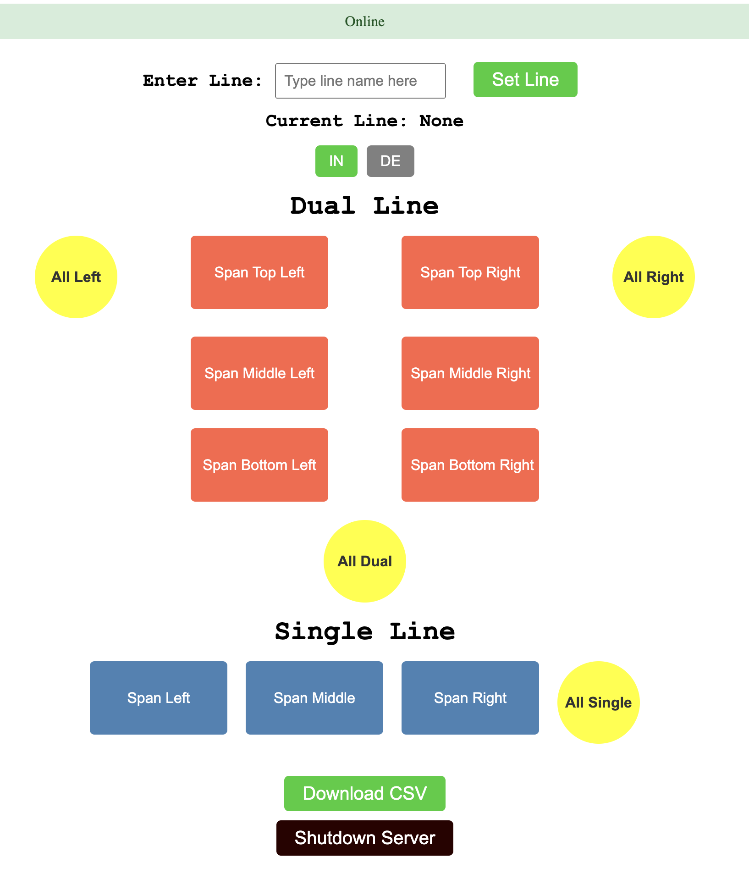

# My Portfolio

🚀 Welcome to my portfolio! Below are some of my featured projects.

---

## 🚁 [Web Loggers in HTML/CSS/JavaScript](#/projects/web_loggers.md)

🔹 **Description:** A short overview of what the project does.  
🔹 **Tech Stack:** Python, Flask, PostgreSQL  
🔹 **[View Source Code](https://github.com/your-username/project1)**

---

## 🖥️ [Virtual Machine in C](#/projects/project2)
 

🔹 **Description:** A game built with JavaFX.  
🔹 **Tech Stack:** Java, Gradle, JavaFX  
🔹 **[View Source Code](https://github.com/your-username/project2)**

---

## 👻 [Pacman in Java](#/projects/project2)
 

🔹 **Description:** A game built with JavaFX.  
🔹 **Tech Stack:** Java, Gradle, JavaFX  
🔹 **[View Source Code](https://github.com/your-username/project2)**

---

## 🐉 [Card Finder in Python](#/projects/project2)
 

🔹 **Description:** A game built with JavaFX.  
🔹 **Tech Stack:** Java, Gradle, JavaFX  
🔹 **[View Source Code](https://github.com/your-username/project2)**

---

📌 Check out more in the [Projects](#/projects/project1) section!
